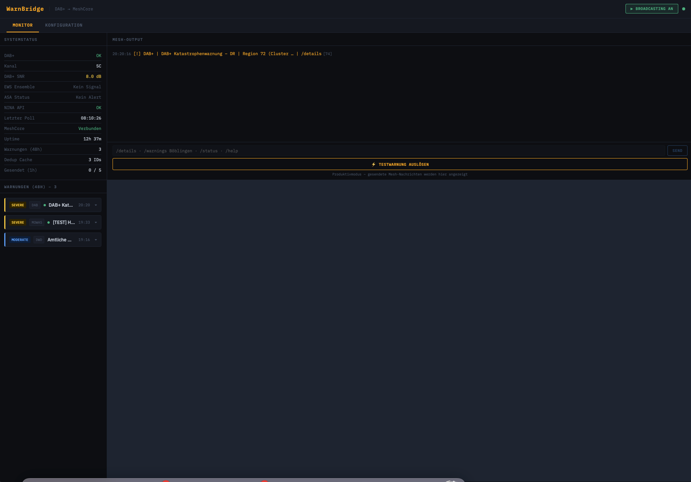
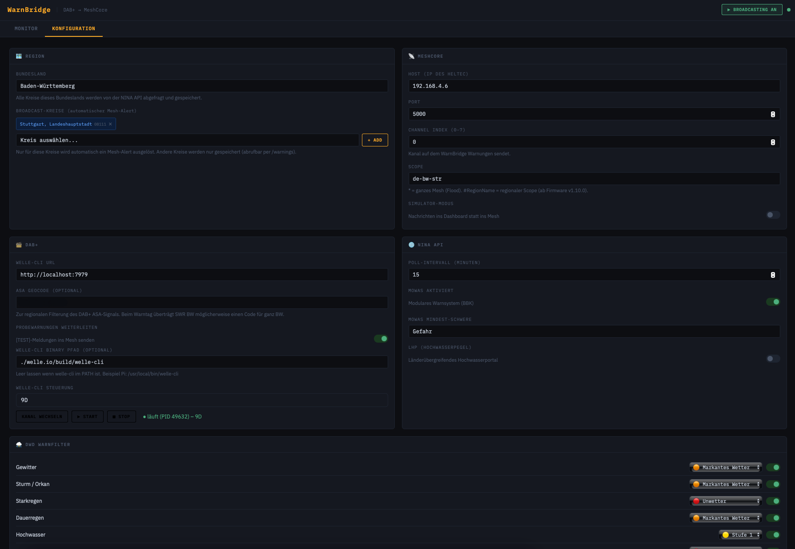

# WarnBridge

**DAB+ Katastrophenwarnungen offline empfangen und ins MeshCore-LoRa-Netz einspeisen.**

WarnBridge empfängt offizielle Warnmeldungen über DAB+ (ASA/Journaline) – vollständig ohne Internet – und leitet sie als kompakte Nachrichten in ein MeshCore-LoRa-Mesh-Netzwerk weiter. Als Fallback dient die NINA API des BBK. Das System läuft autonom auf einem Raspberry Pi und überlebt Strom- und Internetausfall.

---

## Wie es funktioniert



Zwei Eingangswege speisen eine gemeinsame Verarbeitungspipeline:

- **DAB+** – RTL-SDR-Dongle + welle-cli dekodieren das Signal. ASA-Alerts (FIG 0/15) und Journaline-Texte werden ausgewertet, regional gefiltert und weitergeleitet.
- **NINA API** – MoWaS- und DWD-Meldungen werden alle 15 Minuten abgerufen und nach Bundesland + Kreisen gefiltert.

Beide Quellen landen im selben CAP-Normalizer, werden dedupliziert (ID + Inhalts-Hash) und in SQLite gespeichert. Ausgewählte Warnungen werden per TCP an den Heltec LoRa-Node gesendet und von dort ins Mesh geflutet.

---

## Dashboard

| Monitor | Konfiguration |
|---|---|
|  |  |

Das Web-Dashboard ist erreichbar unter `http://warnbridge.local:8080` (Pi) oder `http://localhost:8080` (Mac-Entwicklung). Es zeigt Systemstatus, aktive Warnungen, Mesh-Output und ermöglicht die komplette Konfiguration ohne Neustart.

---

## Funktionen

- Empfang von DAB+ über RTL-SDR (174–240 MHz)
- ASA-Dekodierung nach ETSI TS 104 089 (FIG 0/15: Heartbeat, Trigger, Sustain, End)
- Geocode-Filter: nur Alerts die den konfigurierten Standort betreffen
- Journaline-Dekodierung für Warntexte (Fraunhofer NML Decoder, zlib-komprimiert)
- NINA API: MoWaS (alle Schweregrade konfigurierbar) + DWD (pro Ereignistyp + Stufe)
- CAP-Normalisierung, Deduplizierung, SQLite-Speicherung (48h)
- MeshCore-Integration per TCP, konfigurierbarer Channel + Scope
- Bot-Befehle im Mesh: `/details`, `/warnings <Ort>`, `/status`, `/help`
- Web-Dashboard mit Live-Updates, Konfiguration ohne Neustart, Testwarnung-Funktion
- systemd-Service mit Watchdog-Heartbeat und automatischem welle-cli-Neustart
- Entwicklung ohne Hardware möglich (Simulator-Modus)

---

## Hardware

| Komponente | Modell | Funktion |
|---|---|---|
| Raspberry Pi 4 | 2 GB RAM | Hauptrechner |
| RTL-SDR | Nooelec NESDR SMArt v5 | DAB+-Empfang (174–240 MHz) |
| DAB+-Antenne | Im Bundle | Signal empfangen |
| MeshCore-Node | Heltec WiFi LoRa 32 v3 | TCP-Schnittstelle, LoRa 868 MHz |
| microSD | 32 GB A1/Class 10 | Betriebssystem + DB |

---

## Schnellstart

### macOS (Entwicklung)

```bash
git clone https://github.com/TogeriX-hub/dab-warnings-meshcore
cd dab-warnings-meshcore
bash install.sh
python3 warnbridge.py
```

Dashboard: [http://localhost:8080](http://localhost:8080)

### Raspberry Pi

→ [docs/installation-pi.md](docs/installation-pi.md)

---

## Projektstatus

| Komponente | Status |
|---|---|
| DAB+-Empfang (RTL-SDR + welle-cli) | ✅ |
| ASA-Dekodierung (FIG 0/15) | ✅ |
| ASA Geocode-Filter (ETSI TS 104 089) | ✅ |
| Journaline-Decoder (Fraunhofer NML) | ✅ getestet auf DLF 5C |
| NINA Integration (MoWaS + DWD) | ✅ |
| MeshCore TCP-Integration | ✅ |
| Web-Dashboard | ✅ |
| systemd-Service + Watchdog | ✅ |
| Raspberry Pi Betrieb | ✅ läuft seit Juni 2026 |
| Warntag-Livetest | 🗓 10.09.2026 |

---

## Hinweis zu welle.io

Das Projekt enthält eine angepasste Version von [welle.io](https://github.com/AlbrechtL/welle.io) direkt im Repository (`welle.io/`). Der Fork ergänzt das Original um:

- ASA-Dekodierung über FIG 0/15 (ETSI TS 104 089)
- ASA Holdover: `active=true` bleibt 10s nach Alert-Ende
- Packet-Mode Subchannel Decoder
- Fraunhofer NML Journaline Decoder (zlib-komprimierte JML-Objekte)
- HTTP-Endpunkte `/journaline.json` und `/rxlog.json`

Fork: [github.com/TogeriX-hub/welle.io](https://github.com/TogeriX-hub/welle.io)

---

## Dokumentation

- [Installation macOS](docs/installation-mac.md)
- [Installation Raspberry Pi](docs/installation-pi.md)
- [Konfiguration (config.yaml)](docs/konfiguration.md)

---

## Verwandte Projekte

- [FieldMesh](https://github.com/TogeriX-hub/FieldMesh) – MeshCore-Firmware-Fork für Off-Grid-Einsatz
